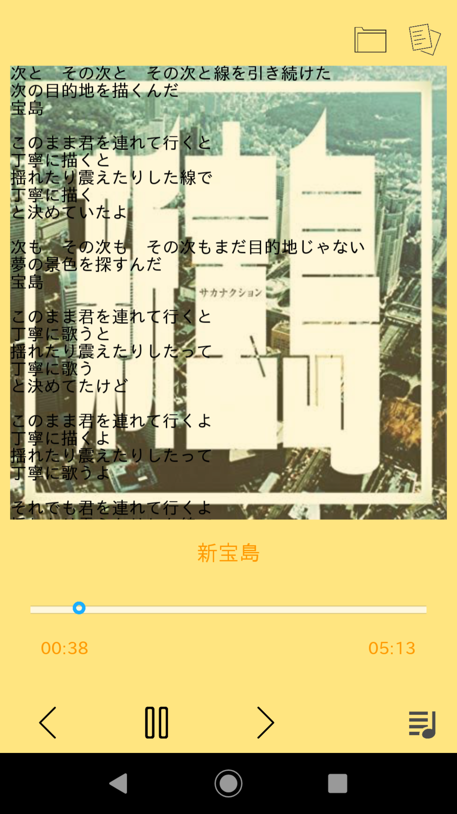

# kivy_player

## 概要
　Kivyを用いて音楽プレーヤーを作りました。

## 説明と操作方法
　再生/一時停止ボタンを押すと楽曲の再生（再生中の場合は一時停止）、＞ボタンで次のトラック、＜ボタンで前のトラックを再生することができます。右下のアイコンは再生リストでこのボタンを押すと再生リストを表示させることが出来ます。再生リストにおいて曲名を選択するとその曲を再生することが出来ます。また右上には2つアイコンがあり、右は歌詞の表示/非表示ボタンでここを押すと歌詞を表示したり非表示に出来ます。なお長押しすると歌詞の色を黒/白と変更することも出来ます。また左のアイコンはフォルダボタンで、ここから別の音楽フォルダを参照することが出来ます。初期設定ではsoundフォルダ内の楽曲を再生リストに登録するようになっており、別のフォルダの楽曲を再生したい場合にはこのフォルダアイコンから該当するフォルダを選択してください。  
 再生中にスライドバーを動かすと再生位置を変えることが出来ます。スライドバーの値が変更される度にon_value部分の関数が実行されるので、そのことを利用してスライドバーを動かす度にpygame.micxer.music.play()の引数にスライドバーの値を渡しその部分から再生されるようにしています。なお再生中1秒ごとにスライドバーが動きますが、変化分が1秒の場合はこの処理が行われないようになっています（schedule_intervalによりpositionメソッドが繰り返し実行されるようになっており、このpositionメソッドを用いてスライドバーの位置が自動的に1秒ごとに動くようにしています）。最後まで再生されると自動的に次のトラックが再生されます。  
 アルバムアートについては指定したフォルダ内に楽曲と同じ名前のjpgファイルがあればそれを読み出し、なければフォルダ内に存在するjpgファイルを、画像データが存在しなければimageフォルダ内にあるデフォルトの画像を読み込むようになっています。そのため好きな画像をアルバムアートとして表示できます。また楽曲と同じ名前のtxtファイルがあれば楽曲再生時にtxtファイル内の文字列が歌詞としてアルバムアート上に表示されます（txtファイルが存在しなければ表示されない）。歌詞は右上のアイコンを押すことで非表示にすることも可能です。  
 初めは音楽ファイルの再生にvlcのMediaPlayerを使用しようと思っていたのですが、androidでプログラムを実行する際にエラーが出てしまったのでpygameのmixerを用いています。pygame.mixer.music.play()の引数に再生位置を与えることで似にの位置から再生することができます。

  
